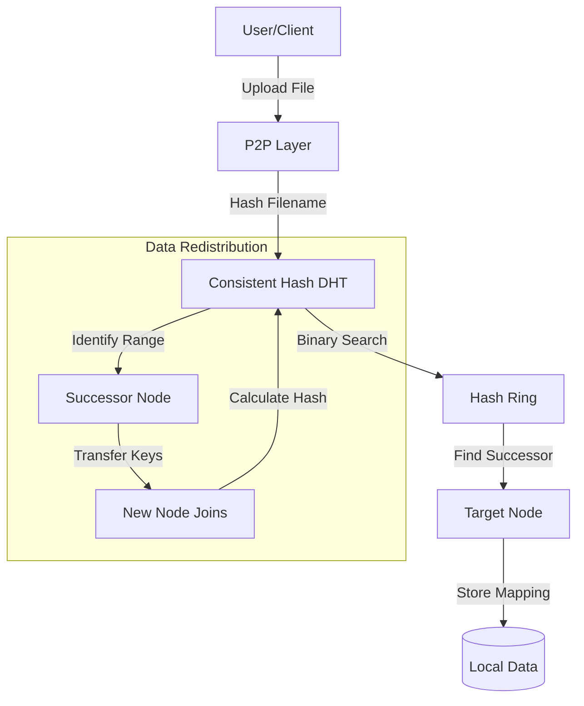

# ADSA-DHT-P2P: Distributed Hash Table & P2P Simulator

Welcome to the **ADSA-DHT-P2P** project! This is a high-performance simulation of a **Distributed Hash Table (DHT)** using **Consistent Hashing**, designed as a foundation for a Peer-to-Peer (P2P) file-sharing network.

It visualizes how data is distributed across a dynamic set of nodes, demonstrating how nodes can join or leave the network with minimal data redistribution.

---

## Core Features

- **Consistent Hashing**: Implements a robust DHT where nodes and data keys are mapped to a 160-bit circular identifier space (SHA-1).
- **Dynamic Node Management**: Add or remove nodes on the fly. The system automatically redistributes only the necessary keys to maintain balance.
- **P2P File Layer**: A conceptual layer that manages "files" as keys and "peers" as values, allowing multiple peers to share the same file.
- **Visual Simulator**: A real-time SVG-based visualization tool (currently being modularized!) to see the "Ring" in action.
- **FastAPI Integration**: (Coming Soon/In Progress) Leveraging modern Python for a high-performance, asynchronous API.

---

## Data Structures & Architecture

### 1. Consistent Hashing Logic
The network is modeled as a circular "ring" from $0$ to $2^{160}-1$.

- **Identifying Nodes**: Each node's name is hashed to determine its position on the ring.
- **Identifying Data**: Each file name is hashed to determine its position.
- **Lookup Rule**: A key is stored on the first node encountered when moving clockwise from the key's position on the ring.

### 2. Primary Classes

#### `ConsistentHashDHT`
The "brain" of the system.
- `nodes`: A hash map (`dict`) where `key` is the ring position and `value` is the `Node` object.
- `sorted_keys`: A sorted list of all active node positions, allowing for $O(\log N)$ lookups using binary search (`bisect`).

#### `Node` (Peer)
Represents a physical or virtual machine in the network.
- `name`: Human-readable identifier.
- `data`: A local dictionary containing the subset of the global DHT that this node is responsible for.

#### `P2PFileSharing`
An abstraction layer for file operations.
- Uses the DHT to map `file_name` $\rightarrow$ `[list_of_peer_names]`.

---

## System Flow (Mermaid)



---

## 🛠️ Tech Stack

- **Backend**: Python 3.10+, FastAPI
- **Frontend**: React (Vite), Framer Motion, Lucide Icons, Axios
- **Algorithms**: SHA-1 Consistent Hashing, Binary Search (Bisect)

---

## 🏃 Getting Started

### 1. Backend (FastAPI)
```bash
# Install dependencies
pip install -r requirements.txt

# Start the server
python main.py
```
The API will be available at `http://127.0.0.1:8000`. You can see the interactive docs at `/docs`.

### 2. Frontend (React)
```bash
cd frontend
npm install
npm run dev
```
Open the provided local URL (usually `http://localhost:5173`).

---

## System Architecture

### Modular Frontend
The UI is built with **React** for true modularity:
- **`App.jsx`**: Manages global network state and API polling.
- **`App.css`**: Implements a glassmorphic, premium dark theme.
- **SVG Engine**: A declarative SVG-based visualization using `framer-motion` for smooth node transitions.

---

## Planned Improvements & Learning path

1. **Virtual Nodes**: Help balance the data distribution. To implement this, try hashing each node name multiple times (e.g., `Node1-v1`, `Node1-v2`) and mapping them all to the same physical node.
2. **Replication**: Store data on the next $k$ nodes to ensure fault tolerance.
3. **Pydantic Validation**: Explore `main.py` to see how Pydantic ensures data integrity.

---
